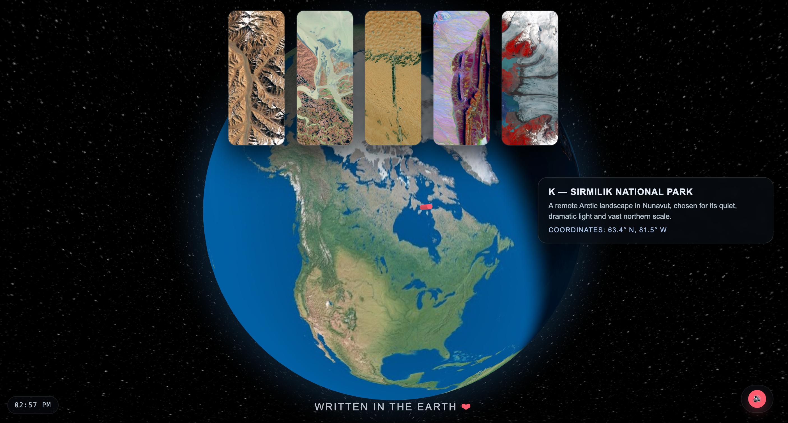

# Katie in the Earth

Interactive globe visualization that spells "Katie" using landscape images for each letter.

Quick start
1. From the project root run:

```bash
python3 -m http.server 8000
```

2. Open http://localhost:8000 in your browser.

Notes
- Background audio file is `song.mp3` in the repo root — if you rename it, update the `src` in `index.html`.
- Click any letter to view its place information and focus the globe; markers are rendered as rising cylinders on the globe.
- Coordinates live in the `letterInfo` object inside `index.html`. Prefer adding numeric `lat`/`lng` there for best accuracy.
- The floating red DOM pin was removed; only globe-rendered markers are used now.

If you want me to add EXIF-based coordinate extraction or run a local play-test here, tell me and I'll proceed.

## Screenshot


